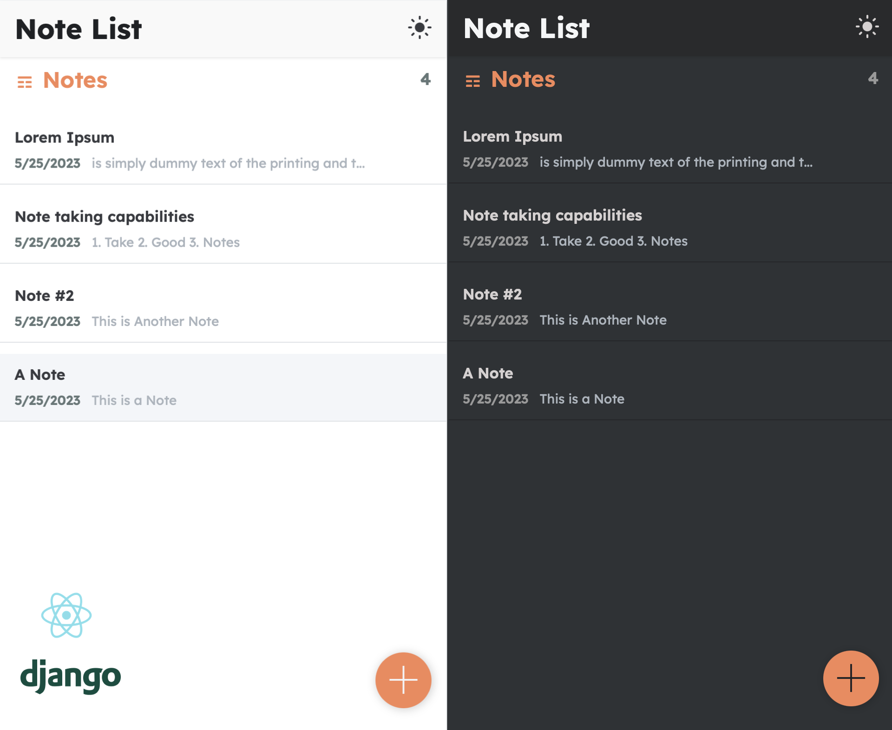

[](https://a-notes-app.herokuapp.com/)


## 
# Notes App
This is a simple notes app built with React and Django.


## Installation


### Prerequisites
- Python (3.x)
- Node.js


### Setting up the Environment

#### Windows
1. Clone the repository:
```shell
git clone https://github.com/thebugged/notes-app.git
```

2. Create a virtual environment: 
```shell
python -m venv venv
```

3. Activate the virtual environment:
```shell
venv\Scripts\activate
```

4. Install the Python dependencies:
```shell
pip install -r requirements.txt
```

5. Install the Node.js dependencies:
```shell
npm install
```


#### macOS/Linux
1. Clone the repository:
```shell
git clone https://github.com/thebugged/notes-app.git
```

2. Create a virtual environment: 
```shell
python -m venv venv
```

3. Activate the virtual environment:
```shell
source venv/bin/activate
```

4. Install the Python dependencies:
```shell
pip install -r requirements.txt
```

5. Install the Node.js dependencies:
```shell
npm install
```


## Running the App
Once you have set up the environment, you can run the app by executing the following command:
```shell
   python manage.py runserver
```

The app will be accessible at http://127.0.0.1:8000/.


## Credits
In appreciation of [Dennis Ivy's](https://github.com/divanov11) guidance throughout the development of this app. If you're interested in web development, I highly recommend checking out his tutorials on [YouTube](https://www.youtube.com/@DennisIvy). 


